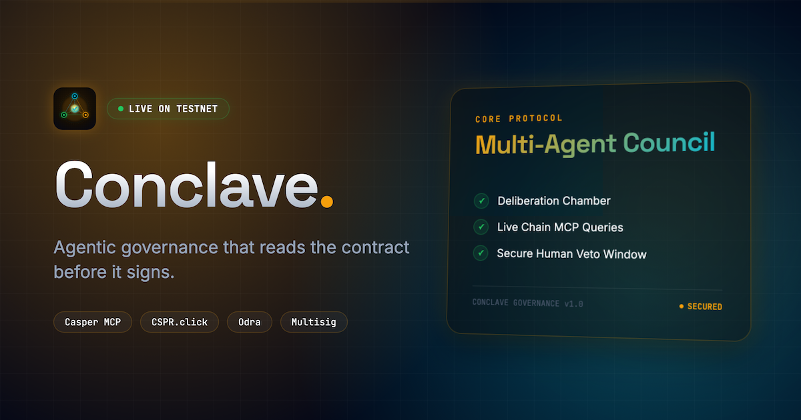
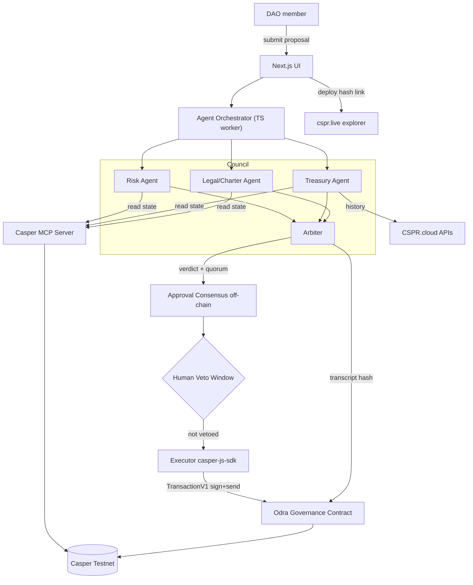

<div align="center">
  
  <h1>Conclave 🗳️</h1>
  <p><em>Agentic governance that reads the contract before it signs.</em></p>
  

  <br/>

  [](https://conclave.edycu.dev)
  [](https://conclave.edycu.dev/pitch.html)
  [](https://youtu.be/0rq362abOuk)
  [](https://dorahacks.io/hackathon/casper-agentic-buildathon)

  <br/>
  
  
  
  
  [](https://github.com/edycutjong/conclave/tree/main/contract)
  
  [](https://mcpx.dev)
  [](https://opensource.org/licenses/MIT)
  [](https://github.com/edycutjong/conclave/actions/workflows/ci.yml)

</div>

---

## 📸 See it in Action

<div align="center">
  
</div>

> **A council of AI agents debates every DAO proposal, grounds it in live Casper state, collects approvals off-chain, and — after a human veto window — executes the approved transaction on Casper Testnet.**

---

## 💡 The Problem & Solution
Current DAOs rely heavily on token holder attention, leading to voter apathy and unverified contract executions.
**Conclave** instantiates a council of AI agents (Risk, Treasury, Legal) that reason over a proposal grounded in Casper account state, then an Arbiter reconciles them into a verdict for a human veto — and only then does the approved transfer execute on Testnet.

**Key Features:**
- ⚡ **Real multi-agent council:** with `ANTHROPIC_API_KEY` set, three role agents run on **Claude Haiku 4.5** and the Arbiter on **Claude Opus 4.8** (Anthropic SDK, structured outputs) — [`src/agents/llm.ts`](src/agents/llm.ts). Each agent only cites numbers from the grounded read layer; it can't invent balances.
- 🛡️ **Deterministic guardrail:** every LLM verdict is checked against a pure `reconcile()` baseline ([`src/core/quorum.ts`](src/core/quorum.ts)); the approved amount is computed from the verdict and clamped, and a charter **§5** violation (self-mint / privilege escalation) is a hard, non-overridable **REJECT**.
- 🧪 **What-If Console (the live demo):** compose *any* proposal (target, entrypoint, amount) and watch the council reason it to **APPROVE / CAP / REJECT** over your input — not a canned script (`/api/whatif` → [`src/core/whatif.ts`](src/core/whatif.ts)).
- 🎚️ **Graceful fallback:** with no API key, the council degrades to a deterministic engine, so the full deliberate → veto → execute pipeline always runs (great for keyless judges).
- 🔒 **Human-in-the-Loop Veto:** the approved transfer is signed with `casper-js-sdk` (backend PEM key) only after the veto window closes.

## 🏗️ Architecture & Tech Stack

| Layer | Technology |
|---|---|
| **Frontend** | Next.js 16, React 19, Tailwind CSS v4 |
| **Testing** | Vitest (152 unit tests), Playwright E2E |
| **Contract** | Odra (Rust) on Casper Testnet |
| **AI Council** | Claude Opus 4.8 (Arbiter) + Claude Haiku 4.5 (Role Agents) via the Anthropic SDK — falls back to a deterministic engine with no key |
| **Grounded reads** | Demo: deterministic fixtures · Live (`CONCLAVE_DEMO=false`): CSPR.cloud REST |
| **Signing** | `casper-js-sdk` (backend PEM key) for autonomous execution · CSPR.click for the frontend veto panel |

### System Data Flow



> 🔍 **Deep Dive:** For a full architectural breakdown, including specific API endpoints, council agent roles, and governance smart contract details, see the detailed [System Architecture Design Document](docs/ARCHITECTURE.md).

## 🏆 Sponsor Tracks Targeted & Code References

*   **Casper Innovation Track (Build Direction #3: Multi-Agent DAO Governance)**
    *   **Multi-agent AI council:** Real Anthropic SDK calls — 3 role agents (Haiku 4.5) + an Arbiter (Opus 4.8) with structured outputs, in [llm.ts](src/agents/llm.ts), guard-railed by the deterministic [quorum.ts](src/core/quorum.ts).
    *   **Casper Testnet Smart Contract:** Built with the Odra framework in Rust, located in [conclave.rs](contract/src/conclave.rs). Enforces quorum rules, recorded verdicts, and a threshold-guarded, capped treasury transfer on-chain.
    *   **Grounded reads:** Account/contract state for the agents — deterministic fixtures in demo, live CSPR.cloud REST in live mode — in [mcp.ts](src/agents/tools/mcp.ts).
    *   **Autonomous signing:** Backend `casper-js-sdk` (PEM key) builds, signs, and broadcasts the `execute` transaction in [casper.ts](src/lib/casper.ts) — no browser wallet required.

## 🚀 Getting Started

### Prerequisites
- Node.js ≥ 20
- pnpm 

### Installation     
1. Clone: `git clone https://github.com/edycutjong/conclave.git`
2. Change directory: `cd conclave`
3. Install: `pnpm install`
4. Configure: `cp .env.example .env.local` and add your keys (CSPR.cloud API key, Anthropic key, Testnet keypair)   
5. Run: `pnpm dev`

### Model Context Protocol (MCP) Setup
Conclave leverages the Model Context Protocol to ground its AI council agents in live Casper blockchain state.

1. **Demo Mode (Default):** No additional setup is required. The MCP client uses the mock grounding layer (fixtures) to verify contract and balance state.
2. **Live Testnet Mode:** Set `CONCLAVE_DEMO=false` and provide your `CSPR_CLOUD_API_KEY` in `.env.local` to query live network parameters.
3. **Casper MCP Server (Docker):** To run the official `msanlisavas/casper-mcp` server locally:
   ```bash
   # Run the Casper MCP server Docker container
   docker pull msanlisavas/casper-mcp:latest
   docker run -d -p 8080:8080 -e CSPR_CLOUD_API_KEY="your_cspr_cloud_api_key" msanlisavas/casper-mcp:latest
   ```
   Add the following line to your `.env.local`:
   ```ini
   CASPER_MCP_URL=http://localhost:8080
   ```

> 💡 **Note for Judges — what's real vs. simulated (no overclaiming):**    
> - **The AI is real.** Set `ANTHROPIC_API_KEY` and the council makes genuine Claude calls (Opus 4.8 Arbiter + 3 Haiku 4.5 role agents). With **no key**, it falls back to a deterministic engine so the pipeline still runs end-to-end — the **What-If console** (`/api/whatif`) reasons over *any* proposal you type either way.
> - **On-chain execution is gated.** By default (`CONCLAVE_DEMO=true`) the `execute` step returns a **clearly-labelled simulated** hash — the UI shows an amber *"simulated · not broadcast"* badge and **no explorer link** (we don't fake a `cspr.live` link). Setting `CONCLAVE_DEMO=false` with a funded key + a deployed `CONCLAVE_CONTRACT_HASH` broadcasts a **real Testnet transaction** and links the live `cspr.live` deploy. See [LIVE_TESTNET.md](LIVE_TESTNET.md).

## ⛓️ Live Testnet Deployment

**Live on Casper Testnet (`casper-test`).** The Odra governance contract is deployed and the install is a confirmed, transaction-producing on-chain event:

| Item | Value |
|---|---|
| Contract package | `hash-0b7fcb9879f8a6fd5dd07f104bf5e74ace7c1a9b3c375c902fbf0bc044248e79` |
| Install deploy | [`03c6b2145f06a1357ef63112f11862020ff916614a9c8bf5e584cc236bbbd6f6` ↗](https://testnet.cspr.live/transaction/03c6b2145f06a1357ef63112f11862020ff916614a9c8bf5e584cc236bbbd6f6) |
| `submit_proposal` | [`6cc8d49d36d6c4ad3d030dfd1b6abecd5c3c3d39baa7c6bb2abd47a2e8593232` ↗](https://testnet.cspr.live/transaction/6cc8d49d36d6c4ad3d030dfd1b6abecd5c3c3d39baa7c6bb2abd47a2e8593232) |
| `record_verdict` | [`e7b6f26caeeabf43fbe174ed68c2bdb49a982753385bc6abcf006e0597c699c4` ↗](https://testnet.cspr.live/transaction/e7b6f26caeeabf43fbe174ed68c2bdb49a982753385bc6abcf006e0597c699c4) |
| `approve` | [`b45648e9c142f4b16ba079f3c72c0319e4e0ab43853f9706f02819d42a92ef1b` ↗](https://testnet.cspr.live/transaction/b45648e9c142f4b16ba079f3c72c0319e4e0ab43853f9706f02819d42a92ef1b) |
| Machine-readable record | [`deployments/testnet.json`](deployments/testnet.json) |

The AI council's governance decisions are recorded on-chain: a proposal is **submitted**, the verdict **recorded**, and **approved** — all real Testnet transactions. Reproduce with `pnpm deploy:rpc` (install) + `pnpm lifecycle` (governance) — see [LIVE_TESTNET.md](LIVE_TESTNET.md).

> _Originality: all code is original and newly developed for the Casper Agentic Buildathon 2026; shared `@vouch/*` packages are authored for this submission._

## 📖 Documentation & Design Resources

The following design documents and resources are available in this repository:
*   🏗️ **[System Architecture](docs/ARCHITECTURE.md):** Full data flow diagrams (Mermaid), API specifications, and math/cryptographic models.
*   🎬 **[Interactive Demo Guide](docs/DEMO.md):** Step-by-step walkthrough of the live demo console and expected system behaviors.
*   🛡️ **[Sponsor Track Defense](docs/SPONSOR_DEFENSE.md):** Justification of track eligibility, including Casper Network and x402 integration references.
*   📋 **[Product Requirements Document (PRD)](docs/PRD.md):** Initial project scope, problem statement, user personas, and product requirements.
*   🚀 **[Live Testnet Wiring Runbook](LIVE_TESTNET.md):** Detailed guide to flipping the application from demo mode to Casper Testnet execution.

## 🧪 Testing & CI

**6-stage pipeline:** Quality → Security → Build → E2E → Performance → Deploy

```bash
# ── Code Quality ────────────────────────────
pnpm run lint          # ESLint
pnpm run typecheck     # TypeScript check
pnpm run test          # Run Vitest tests
pnpm run test:coverage # Coverage report
pnpm run ci            # Full quality gate

# ── Advanced Testing ────────────────────────
pnpm run e2e           # Playwright E2E tests
pnpm run e2e:ui        # Playwright interactive mode
pnpm run lighthouse    # Lighthouse CI audit

# ── Security ────────────────────────────────
make security-scan     # pnpm audit + license check
```

| Layer | Tool | Status |
|---|---|---|
| Code Quality | ESLint + TypeScript | ✅ |
| Unit Testing | Vitest (152 tests) | ✅ |
| E2E Testing | Playwright (3 suites) | ✅ |
| Security (SAST) | CodeQL | ✅ |
| Security (SCA) | Dependabot + pnpm audit | ✅ |
| Secret Scanning | TruffleHog | ✅ |

## 📄 License

This project is licensed under the [MIT License](LICENSE) — see the LICENSE file for details.

