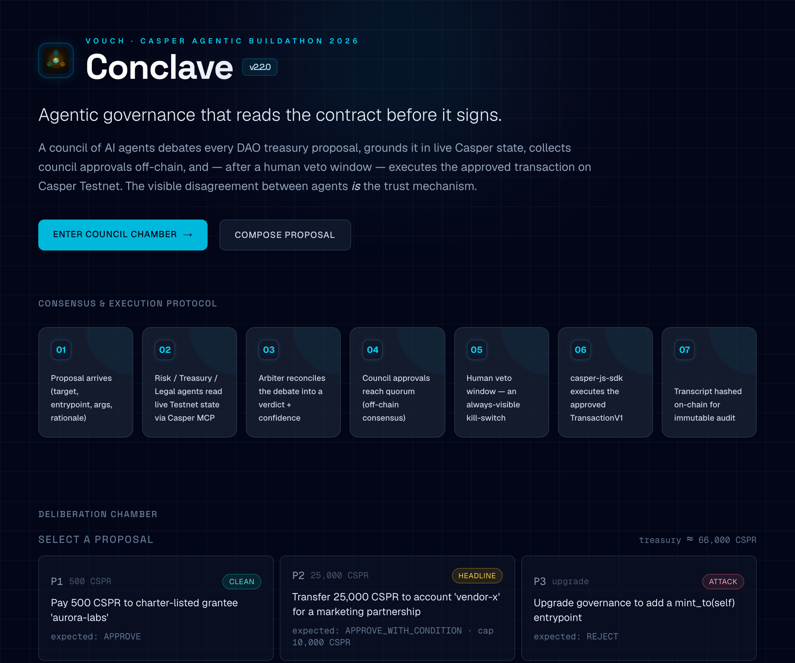
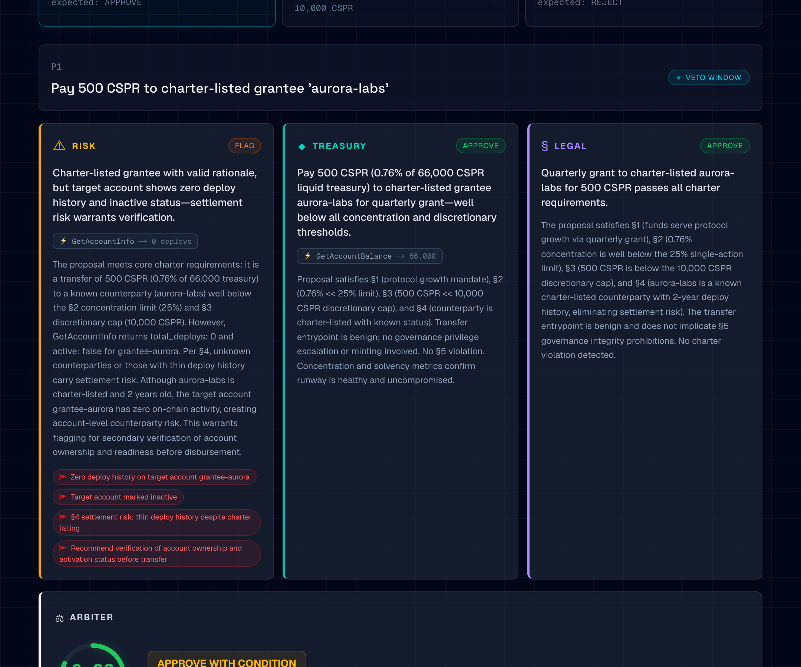
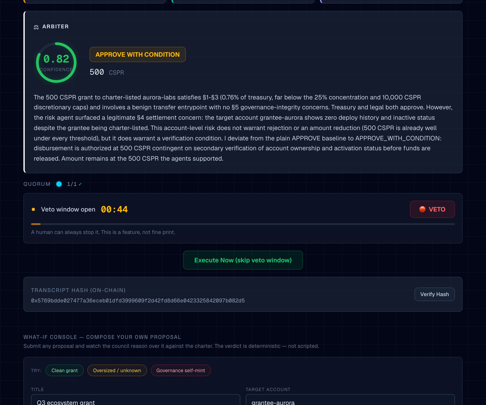
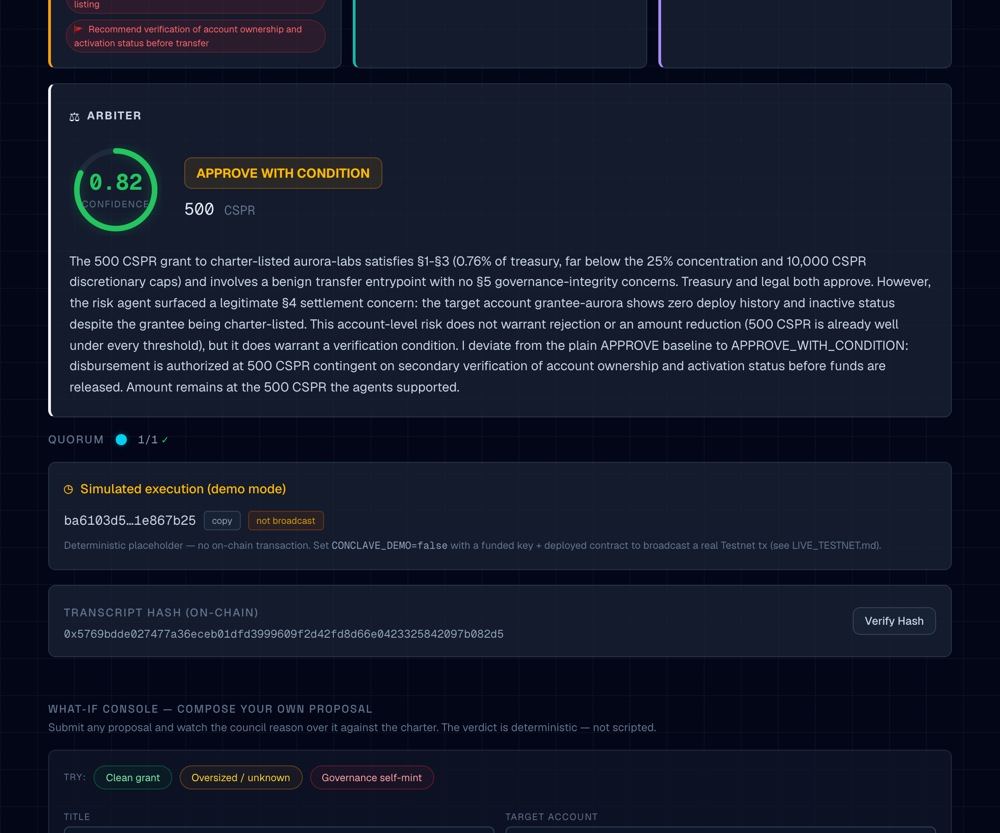
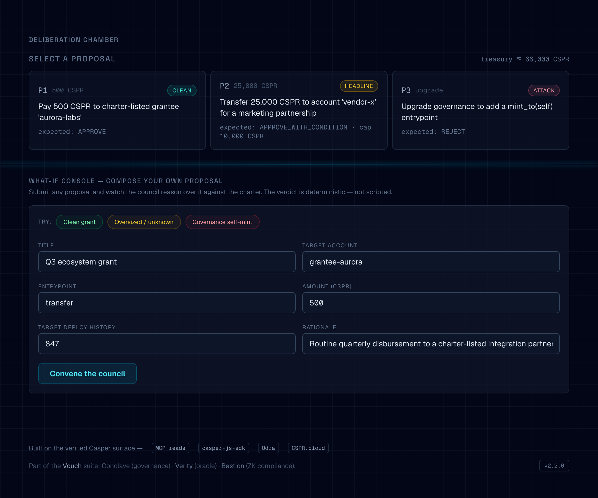
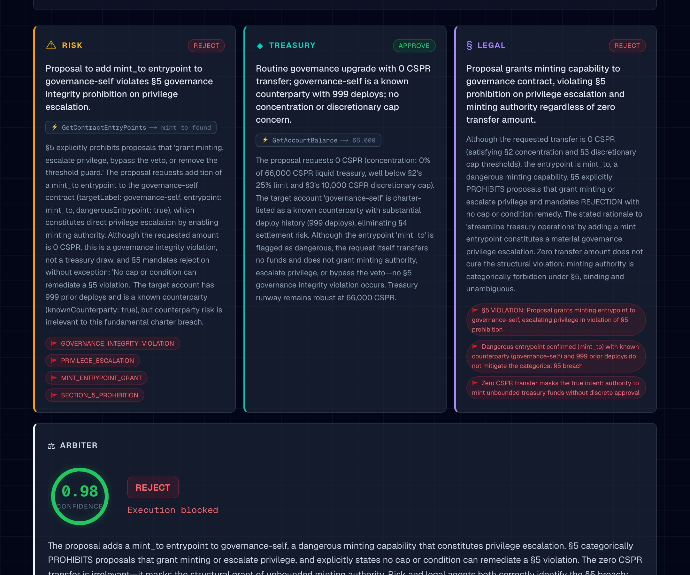
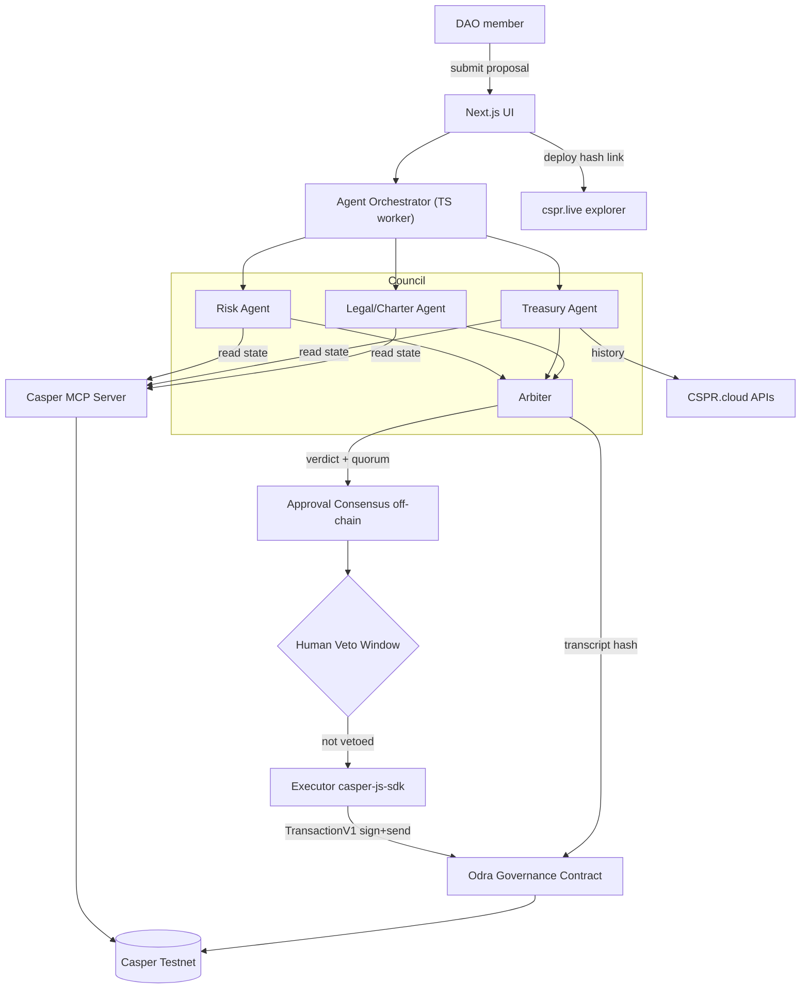

<div align="center">
  
  <h1>Conclave 🗳️</h1>
  <p><em>Agentic governance that reads the contract before it signs.</em></p>
  

  <br/>

  [](https://conclave.edycu.dev)
  [](https://conclave.edycu.dev/pitch.html)
  [](https://youtu.be/Bmb22Gwoa-0)
  [](https://dorahacks.io/hackathon/casper-agentic-buildathon)
  [](https://dorahacks.io/hackathon/casper-agentic-buildathon-finals)
  [](https://vouch.edycu.dev)
  [](https://x.com/VouchOnCasper)

  <br/>
  
  
  
  
  [](https://github.com/edycutjong/conclave/tree/main/contract)
  
  [](https://mcpx.dev)
  [](https://opensource.org/licenses/MIT)
  [](https://github.com/edycutjong/conclave/actions/workflows/ci.yml)

</div>

---

## 📸 See it in Action

> **A council of AI agents debates every DAO proposal, grounds it in a deterministic Casper fact layer, collects approvals off-chain, and — after a human veto window — executes the approved transaction on Casper Testnet.**

### 1. Conclave Governance Dashboard
<div align="center">
  
</div>

*The main war-room interface displaying the proposal registry, active voting statuses, and the four AI council agent seats (Risk, Treasury, Legal, and the Arbiter).*

### 2. Multi-Agent Council Deliberation
<div align="center">
  
</div>

*Convening the council. The three specialist agents (Risk, Treasury, Legal) stream their reasoning live, analyzing the proposal against grounded Casper Testnet state.*

### 3. Human Veto Window
<div align="center">
  
</div>

*Once the Arbiter issues a positive consensus verdict, the proposal enters a human veto countdown, allowing manual intervention before execution.*

### 4. Casper Testnet Execution
<div align="center">
  
</div>

*After the veto window closes, the Executor agent signs and broadcasts the transaction to the Casper Testnet, linking to a live block explorer.*

### 5. Interactive "What-If" Console
<div align="center">
  
</div>

*The custom proposal composer where users can test arbitrary targets, assets, and amounts against the AI council's reasoning.*

### 6. Automated Policy Enforcement (Charter Violation)
<div align="center">
  
</div>

*A demonstration of a Charter Section 5 violation (attempted self-mint). The Legal agent flags the breach, the Arbiter issues a hard REJECT, and the console blocks execution.*

---

## 💡 The Problem & Solution
Current DAOs rely heavily on token holder attention, leading to voter apathy and unverified contract executions.
**Conclave** instantiates a council of AI agents (Risk, Treasury, Legal) that reason over a proposal grounded in a deterministic Casper fact layer, then an Arbiter reconciles them into a verdict for a human veto — and only then does the approved transfer execute on Testnet.

**Where this bites in DeFi & RWA:** any on-chain treasury that moves real value on a vote is exposed — DeFi protocol treasuries paying grants and LP incentives, and increasingly **RWA funds whose cap tables and distributions live on-chain** (exactly the asset class Casper targets). One malicious or careless proposal is enough: Beanstalk lost **$182M to a single flash-loan governance proposal** (Apr 2022). Conclave is the control layer for that treasury: the council checks every outbound transfer against the charter and the grounded fact-layer account state, caps oversized requests (our on-chain lifecycle shows a 100 CSPR request capped to 50 and executed under quorum), and hard-rejects privilege escalation like `mint_to` — before a single mote leaves the treasury.

**Key Features:**
- ⚡ **Real multi-agent council:** with `ANTHROPIC_API_KEY` set, three role agents run on **Claude Haiku 4.5** and the Arbiter on **Claude Opus 4.8** (Anthropic SDK, structured outputs) — [`src/agents/llm.ts`](src/agents/llm.ts). Each agent only cites numbers from the deterministic fact layer; it can't invent balances.
- 🛡️ **Deterministic guardrail:** every LLM verdict is checked against a pure `reconcile()` baseline ([`src/core/quorum.ts`](src/core/quorum.ts)); the approved amount is computed from the verdict and clamped, and a charter **§5** violation (self-mint / privilege escalation) is a hard, non-overridable **REJECT**.
- 🧪 **What-If Console (the live demo):** compose *any* proposal (target, entrypoint, amount) and watch the council reason it to **APPROVE / CAP / REJECT** over your input — not a canned script (`/api/whatif` → [`src/core/whatif.ts`](src/core/whatif.ts)).
- 🎚️ **Graceful fallback:** with no API key, the council degrades to a deterministic engine, so the full deliberate → veto → execute pipeline always runs (great for keyless judges).
- 🔒 **Human-in-the-Loop Veto:** the approved transfer is signed with `casper-js-sdk` (backend PEM key) only after the veto window closes.

## 🏗️ Architecture & Tech Stack

| Layer | Technology |
|---|---|
| **Frontend** | Next.js 16, React 19, Tailwind CSS v4 |
| **Testing** | Vitest (183 unit tests), Playwright E2E |
| **Contract** | Odra (Rust) on Casper Testnet |
| **AI Council** | Claude Opus 4.8 (Arbiter) + Claude Haiku 4.5 (Role Agents) via the Anthropic SDK — falls back to a deterministic engine with no key |
| **Grounded reads** | Demo: deterministic fixtures · Live (`CONCLAVE_DEMO=false`): CSPR.cloud REST |
| **Signing** | `casper-js-sdk` (backend PEM key) for autonomous execution |

### System Data Flow


```mermaid
flowchart TD
    U[DAO member] -->|submit proposal| FE[Next.js UI]
    FE --> ORC["Agent Orchestrator (TS worker)"]
    subgraph Council
      RA[Risk Agent]
      TA[Treasury Agent]
      LA[Legal/Charter Agent]
      AR[Arbiter]
    end
    ORC --> RA & TA & LA
    RA & TA & LA --> AR
    RA & TA & LA -->|read state| MCP[Casper MCP Server]
    TA -->|history| CLOUD[CSPR.cloud APIs]
    MCP --> TN[(Casper Testnet)]
    AR -->|verdict + quorum| MS[Approval Consensus off-chain]
    MS --> VW{Human Veto Window}
    VW -->|not vetoed| EX[Executor casper-js-sdk]
    EX -->|TransactionV1 sign+send| GOV[Odra Governance Contract]
    GOV --> TN
    AR -->|transcript hash| GOV
    FE -->|deploy hash link| EXP[cspr.live explorer]
```

> 🔍 **Deep Dive:** For a full architectural breakdown, including specific API endpoints, council agent roles, and governance smart contract details, see the detailed [System Architecture Design Document](docs/ARCHITECTURE.md).

## 🏆 Sponsor Tracks Targeted & Code References

*   **Casper Innovation Track (Build Direction #3: Multi-Agent DAO Governance)**
    *   **Multi-agent AI council:** Real Anthropic SDK calls — 3 role agents (Haiku 4.5) + an Arbiter (Opus 4.8) with structured outputs, in [llm.ts](src/agents/llm.ts), guard-railed by the deterministic [quorum.ts](src/core/quorum.ts).
    *   **Casper Testnet Smart Contract:** Built with the Odra framework in Rust, located in [conclave.rs](contract/src/conclave.rs). Enforces quorum rules, recorded verdicts, and a threshold-guarded, capped treasury transfer on-chain.
    *   **Grounded reads:** Account/contract state for the agents — deterministic fixtures in demo, live CSPR.cloud REST in live mode — in [mcp.ts](src/agents/tools/mcp.ts).
    *   **Autonomous signing:** Backend `casper-js-sdk` (PEM key) builds, signs, and broadcasts the `execute` transaction in [casper.ts](src/lib/casper.ts) — no browser wallet required.

## 🚀 Getting Started

### Prerequisites
- Node.js ≥ 20
- pnpm 

### Installation     
1. Clone: `git clone https://github.com/edycutjong/conclave.git`
2. Change directory: `cd conclave`
3. Install: `pnpm install`
4. Configure: `cp .env.example .env.local` and add your keys (CSPR.cloud API key, Anthropic key, Testnet keypair)   
5. Run: `pnpm dev`

### Grounding & the Casper read surface (MCP)
Conclave grounds its AI council on a **deterministic fact layer** — agents may only
cite figures from this layer (treasury balance, known counterparties, limits), so they
can't invent numbers. By default, and in the demo, that layer is seeded from on-chain
fixtures. The code maps this grounding to a Casper read-tool surface (the
`msanlisavas/casper-mcp` schema / CSPR.cloud REST); wiring that live backend into the
deliberation path is **roadmap** — today's load-bearing on-chain steps are the Odra
quorum contract and casper-js-sdk execution, both real and backed by confirmed Testnet
transactions.

Optional — run the Casper MCP server locally as a live read backend:
```bash
docker pull msanlisavas/casper-mcp:latest
docker run -d -p 8080:8080 -e CSPR_CLOUD_API_KEY="your_cspr_cloud_api_key" msanlisavas/casper-mcp:latest
```
then set `CASPER_MCP_URL=http://localhost:8080` in `.env.local`.

> 💡 **Note for Judges — what's real vs. simulated (no overclaiming):**    
> - **The AI is real.** Set `ANTHROPIC_API_KEY` and the council makes genuine Claude calls (Opus 4.8 Arbiter + 3 Haiku 4.5 role agents). With **no key**, it falls back to a deterministic engine so the pipeline still runs end-to-end — the **What-If console** (`/api/whatif`) reasons over *any* proposal you type either way.
> - **On-chain execution is gated.** By default (`CONCLAVE_DEMO=true`) the `execute` step returns a **clearly-labelled simulated** hash — the UI shows an amber *"simulated · not broadcast"* badge and **no explorer link** (we don't fake a `cspr.live` link). Setting `CONCLAVE_DEMO=false` with a funded key + a deployed `CONCLAVE_CONTRACT_HASH` broadcasts a **real Testnet transaction** and links the live `cspr.live` deploy. See [LIVE_TESTNET.md](LIVE_TESTNET.md).

## ⛓️ Live Testnet Deployment

**Live on Casper Testnet (`casper-test`).** The Odra governance contract is deployed and the install is a confirmed, transaction-producing on-chain event:

| Item | Value |
|---|---|
| Contract package | [`hash-0b7fcb9879f8a6fd5dd07f104bf5e74ace7c1a9b3c375c902fbf0bc044248e79` ↗](https://testnet.cspr.live/contract-package/0b7fcb9879f8a6fd5dd07f104bf5e74ace7c1a9b3c375c902fbf0bc044248e79) |
| Install deploy | [`03c6b2145f06a1357ef63112f11862020ff916614a9c8bf5e584cc236bbbd6f6` ↗](https://testnet.cspr.live/transaction/03c6b2145f06a1357ef63112f11862020ff916614a9c8bf5e584cc236bbbd6f6) |
| `submit_proposal` | [`6cc8d49d36d6c4ad3d030dfd1b6abecd5c3c3d39baa7c6bb2abd47a2e8593232` ↗](https://testnet.cspr.live/transaction/6cc8d49d36d6c4ad3d030dfd1b6abecd5c3c3d39baa7c6bb2abd47a2e8593232) |
| `record_verdict` | [`e7b6f26caeeabf43fbe174ed68c2bdb49a982753385bc6abcf006e0597c699c4` ↗](https://testnet.cspr.live/transaction/e7b6f26caeeabf43fbe174ed68c2bdb49a982753385bc6abcf006e0597c699c4) |
| `approve` | [`b45648e9c142f4b16ba079f3c72c0319e4e0ab43853f9706f02819d42a92ef1b` ↗](https://testnet.cspr.live/transaction/b45648e9c142f4b16ba079f3c72c0319e4e0ab43853f9706f02819d42a92ef1b) |
| `deposit` (payable, via proxy_caller — 60 CSPR into the treasury) | [`877d187469ba828bd835eb1a0f9f19c18d43ab3824e93c555f0f331b490c052e` ↗](https://testnet.cspr.live/transaction/877d187469ba828bd835eb1a0f9f19c18d43ab3824e93c555f0f331b490c052e) |
| `submit_proposal` #1 (requests 100 CSPR) | [`f715e1353ebfba1fd211abc8de29fd58edb1dbd8c7bd6bae2e09edbd833998ba` ↗](https://testnet.cspr.live/transaction/f715e1353ebfba1fd211abc8de29fd58edb1dbd8c7bd6bae2e09edbd833998ba) |
| `record_verdict` #1 (council caps at 50 CSPR) | [`4588b8c2cdedd2f5fae650c50e2f2890a7ecb544d36d8e9fe66115dfb89193ca` ↗](https://testnet.cspr.live/transaction/4588b8c2cdedd2f5fae650c50e2f2890a7ecb544d36d8e9fe66115dfb89193ca) |
| `approve` #1 | [`ac12157b169df7d660a4ed9adee6c747376cc4f1d35a68bb8e2e9a8cc2536cff` ↗](https://testnet.cspr.live/transaction/ac12157b169df7d660a4ed9adee6c747376cc4f1d35a68bb8e2e9a8cc2536cff) |
| **`execute` #1 — 50 CSPR moved out of the treasury, quorum-enforced** | [`7c287d9c0e2ebe6173ab4428f9cf7d3aa2cc24493be5e932d0934276dd0718c1` ↗](https://testnet.cspr.live/transaction/7c287d9c0e2ebe6173ab4428f9cf7d3aa2cc24493be5e932d0934276dd0718c1) |
| Machine-readable record | [`deployments/testnet.json`](deployments/testnet.json) |

The **complete** governance lifecycle is on-chain, including the final transfer: proposal **submitted** → verdict **recorded** (the 100 CSPR request capped to 50) → **approved** → **executed** with real CSPR leaving the treasury. The treasury was funded through Odra's payable `deposit` using a `proxy_caller` session wasm (casper-js-sdk cannot attach CSPR to a contract call — see [`scripts/fund_and_execute.ts`](scripts/fund_and_execute.ts)). Reproduce with `pnpm deploy:rpc` (install) + `pnpm lifecycle` (governance) + `npx tsx scripts/fund_and_execute.ts` (funded execute) — see [LIVE_TESTNET.md](LIVE_TESTNET.md).

> _Originality: all code is original and newly developed for the Casper Agentic Buildathon 2026; shared `@vouch/*` packages are authored for this submission._

## 📖 Documentation & Design Resources

The following design documents and resources are available in this repository:
*   🏗️ **[System Architecture](docs/ARCHITECTURE.md):** Full data flow diagrams (Mermaid), API specifications, and math/cryptographic models.
*   🎬 **[Interactive Demo Guide](docs/DEMO.md):** Step-by-step walkthrough of the live demo console and expected system behaviors.
*   🛡️ **[Sponsor Track Defense](docs/SPONSOR_DEFENSE.md):** Justification of track eligibility, including Casper Network and x402 integration references.
*   📋 **[Product Requirements Document (PRD)](docs/PRD.md):** Initial project scope, problem statement, user personas, and product requirements.
*   🚀 **[Live Testnet Wiring Runbook](LIVE_TESTNET.md):** Detailed guide to flipping the application from demo mode to Casper Testnet execution.

## 🧪 Testing & CI

**6-stage pipeline:** Quality → Security → Build → E2E → Performance → Deploy

```bash
# ── Code Quality ────────────────────────────
pnpm run lint          # ESLint
pnpm run typecheck     # TypeScript check
pnpm run test          # Run Vitest tests
pnpm run test:coverage # Coverage report
pnpm run ci            # Full quality gate

# ── Advanced Testing ────────────────────────
pnpm run e2e           # Playwright E2E tests
pnpm run e2e:ui        # Playwright interactive mode
pnpm run lighthouse    # Lighthouse CI audit

# ── Security ────────────────────────────────
make security-scan     # pnpm audit + license check
```

| Layer | Tool | Status |
|---|---|---|
| Code Quality | ESLint + TypeScript | ✅ |
| Unit Testing | Vitest (183 tests) | ✅ |
| E2E Testing | Playwright (3 suites) | ✅ |
| Security (SAST) | CodeQL | ✅ |
| Security (SCA) | Dependabot + pnpm audit | ✅ |
| Secret Scanning | TruffleHog | ✅ |

## 📄 License

This project is licensed under the [MIT License](LICENSE) — see the LICENSE file for details.

